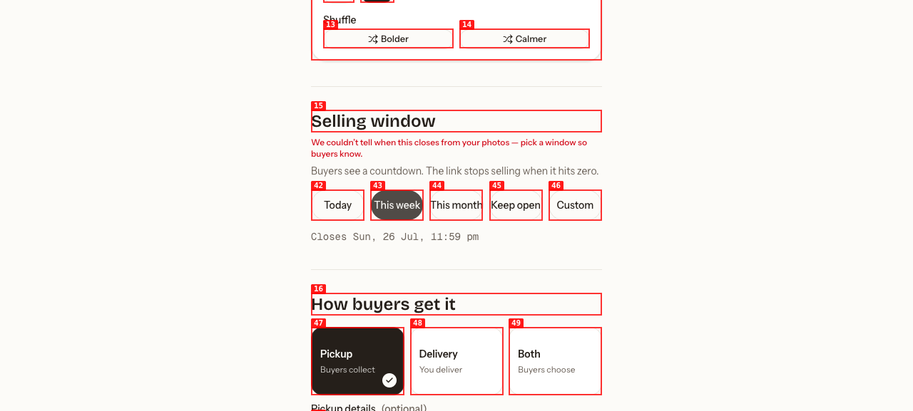

# Dogfood Report: Drops — arrrrcade fashion flow

| Field | Value |
|-------|-------|
| **Date** | 2026-07-20 |
| **App URL** | http://localhost:3000 |
| **Session** | arrrrcade-fashion |
| **Scope** | Four fashion photos → agent draft → seller configuration → this-week launch → buyer options checkout |

## Summary

| Severity | Count |
|----------|-------|
| Critical | 0 |
| High | 0 |
| Medium | 0 |
| Low | 1 |
| **Total** | **1** |

## Issues

### ISSUE-001: Size summary is not pluralized

| Field | Value |
|-------|-------|
| **Severity** | low |
| **Category** | content |
| **URL** | http://localhost:3000/new |
| **Repro Video** | N/A |
| **Status** | Fixed before production deployment |

**Description**

After applying the S–XL preset, every collapsed product card says “4 size”. It should read “4 sizes” or “Sizes: S · M · L · XL”.

**Repro Steps**

1. Upload the four fashion images, generate the draft, and click “Add sizes to all”. The collapsed choice summaries use the grammatically incorrect label.
   

---
